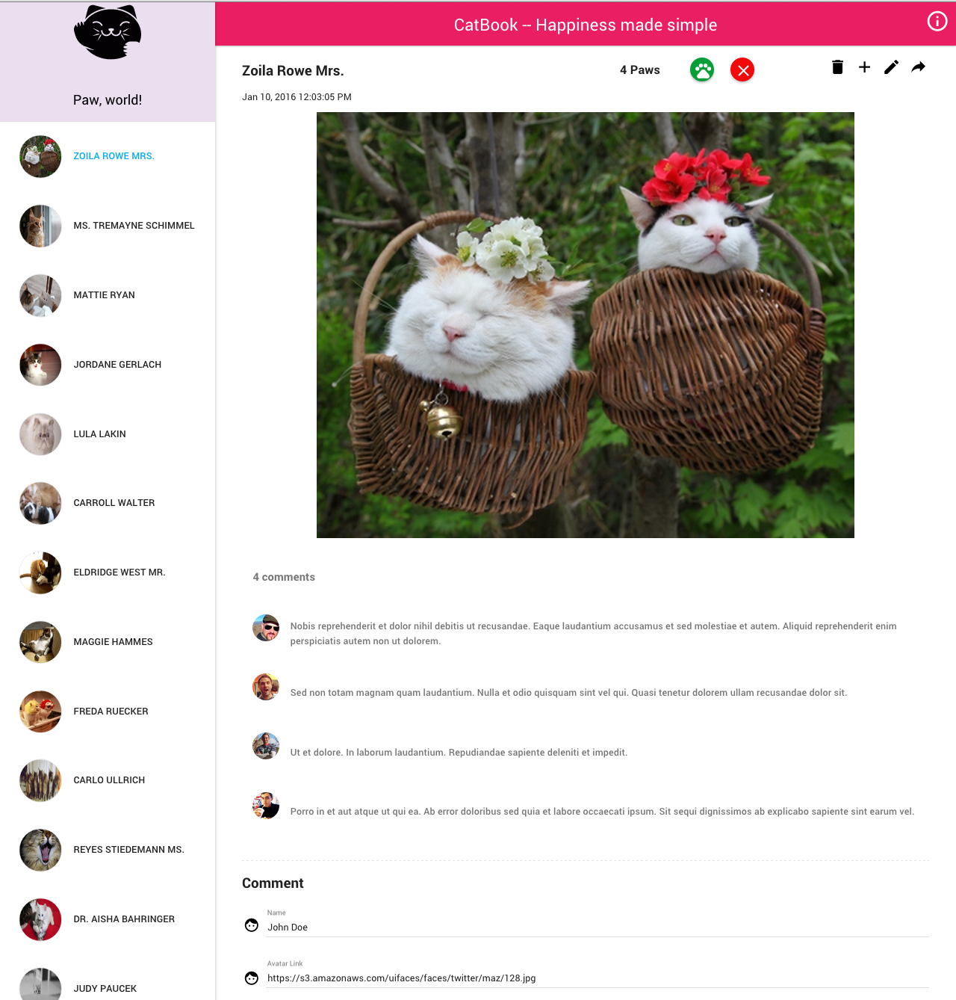

# CatBook / CatCraz
CatBook, formerly known as CatCraz,  is an Angular web app that entertains people with funny cat pictures.

CatBook helps you get out of boredom, greatlly reduce your stress level, and ultimately improve your mental and physical health.

### Tech Stack: 
Angular, Angular-Material, NodeJS, Node-Restful, Express, MongoDB, Heroku 

### Demo 
1. visit http://CatBook100.heroku.com 

### Develop

1. Run `npm install` to install server dependencies.

2. Run `mongod` in a separate shell to keep an instance of the MongoDB Daemon running

3. Run `grunt` to start the development server.

### Deploy
Push to heroku or connect Heroku with github repo, and create a mongolab add-on under Heroku resources

### TODO (may not finish)
- [ ] Add cat 
- [ ] Edit cat 
- [ ] Share cat 
- [ ] Add more cat picture  

### Author  
   [Audrey Li](http://audreyli.me) 

